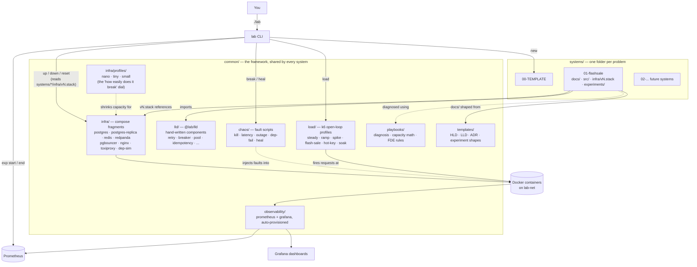

# Architecture

```mermaid
graph TD
    You[You] -->|"./lab <command>"| CLI[lab CLI]

    subgraph FW["common/ — the framework, shared by every system"]
        Infra["infra/ — compose fragments<br/>postgres · postgres-replica · redis · redpanda<br/>pgbouncer · nginx · toxiproxy · dep-sim"]
        Profiles["infra/profiles/<br/>nano · tiny · small<br/>(the 'how easily does it break' dial)"]
        LLD["lld/ — @lab/lld<br/>hand-written components<br/>retry · breaker · pool · idempotency · ..."]
        Load["load/ — k6 open-loop profiles<br/>steady · ramp · spike · flash-sale · hot-key · soak"]
        Chaos["chaos/ — fault scripts<br/>kill · latency · outage · dep-fail · heal"]
        Obs["observability/<br/>prometheus + grafana, auto-provisioned"]
        Play["playbooks/<br/>diagnosis · capacity math · FDE rules"]
        Tmpl["templates/<br/>HLD · LLD · ADR · experiment shapes"]
    end

    subgraph SYS["systems/ — one folder per problem"]
        Template["00-TEMPLATE"]
        FlashSale["01-flashsale<br/>docs/ · src/ · infra/vN.stack · experiments/"]
        Future["02-... future systems"]
    end

    Containers[("Docker containers<br/>on lab-net")]
    Prom[("Prometheus")]
    Grafana["Grafana dashboards"]

    CLI -->|"new"| Template
    CLI -->|"up / down / reset<br/>(reads systems/*/infra/vN.stack)"| Infra
    CLI -->|"load"| Load
    CLI -->|"break / heal"| Chaos
    CLI -->|"exp start / end"| Prom

    Infra --> Containers
    Profiles -.->|"shrinks capacity for"| Infra
    Containers --> Obs
    Obs --> Prom
    Obs --> Grafana
    Chaos -.->|"injects faults into"| Containers
    Load -->|"fires requests at"| Containers

    FlashSale -->|"vN.stack references"| Infra
    FlashSale -->|"imports"| LLD
    FlashSale -->|"docs/ shaped from"| Tmpl
    FlashSale -.->|"diagnosed using"| Play
```
