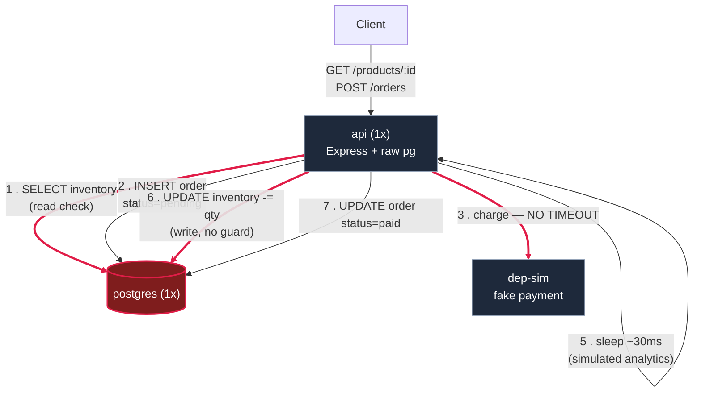

## What's red, and why

| Element | Bug | Proven by |
|---|---|---|
| `postgres` box | single instance, untuned pool, no replica | forced at v1 (`ConnectionPool`), v2 (replica) |
| edge 1 (`SELECT inventory`) + edge 6 (`UPDATE inventory`) | **inventory race** — the read and the write are 5 steps apart, nothing atomic, nothing locked | EXP-003 — confirmed live: inventory `-17`, 28 orders sold against 10 stock |
| edge 3 (`charge`, api → dep-sim) | **no timeout** — a hung dep-sim hangs this request forever | `common/chaos/faults/dep-fail.sh` |
| `api` box | single instance — no LB, dies = whole system down | forced at v1 |

## What's explicitly NOT here yet

No nginx, no load balancer, no cache, no queue, no read replica, no
connection pooler. One box per component, on purpose — this is the
before-picture. Compare against `docs/hld/v1.md` once it exists to show
the audience the diff, one box at a time.
